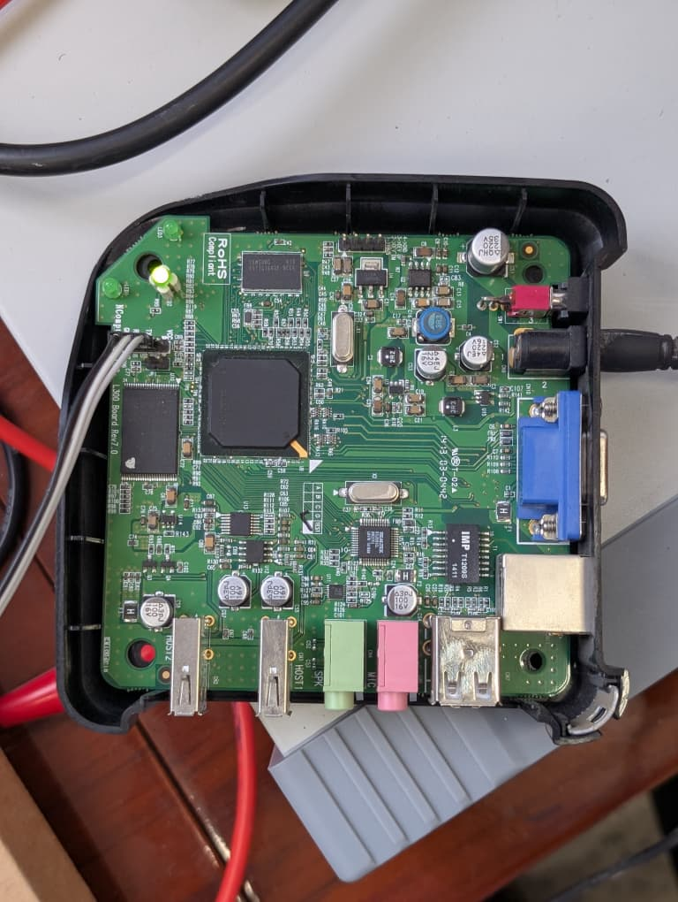
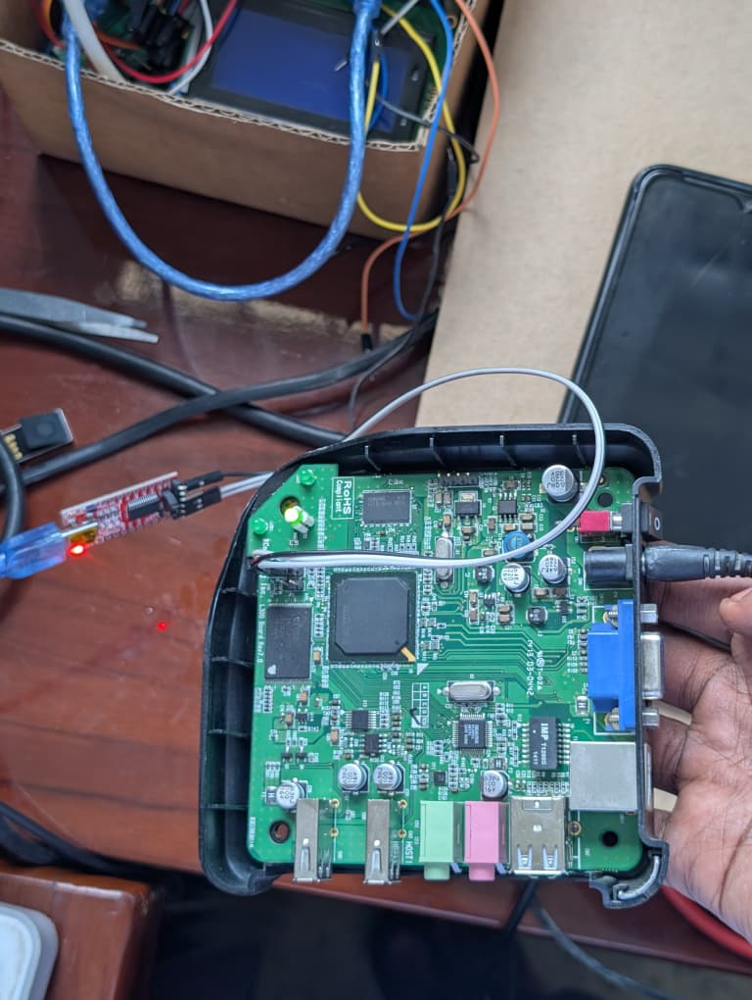

# L300 Open Thin Client

This is my attempt to turn the NComputing L300 into a more open and usable thin client.

The main goal is to run a standalone Linux-based RDP client directly on the L300 hardware while keeping as much of the original hardware working as possible. So far I've been working on the framebuffer, keyboard and mouse input, network booting, NAND flashing, RDP performance, and understanding some of the weird hardware-specific parts of this device.

<p align="center">
  
</p>

## Stage 1

Stage 1 is now working on a real NComputing L300.

At this point I have:

- Linux booting on the L300 ARM platform
- a direct framebuffer RDP client
- 1024x768 display output
- Windows Remote Desktop connectivity
- working keyboard input
- corrected USB mouse handling
- corrected framebuffer colors
- optimized framebuffer update paths
- working NAND boot
- verification and regression tests for the changes

The PERFORMANCE-v1 work made normal Windows desktop usage **a lot better** compared to where this project started.

Things like opening windows, moving around the desktop, typing, using the mouse and normal UI updates are much more usable now.

Video is a different story. It improved a little, but 720p playback is still nowhere near smooth enough, so I'm not calling video performance solved yet.

## Hardware

The device I'm testing on is an NComputing L300 with:

- ARM926-class processor
- 128 MiB NAND
- 128 KiB NAND erase blocks
- Linux 2.6.19.2 vendor environment
- framebuffer display output
- Tempest USB/input hardware

This thing is old enough that getting newer software onto it isn't as simple as cross-compiling an ARM binary and copying it over. A lot of modern Linux software expects kernel and libc features that simply aren't there.

That's one of the interesting parts of this project.

### Development setup

All of this is being tested on physical L300 hardware. Serial access has been especially useful for working with U-Boot, watching the kernel boot and recovering when something goes wrong.



## Mouse compatibility

The mouse was one of the more annoying problems.

After looking at the Tempest USB input path and comparing the actual reports coming from the hardware, I found an alignment problem affecting the 10-byte mouse reports.

The working interpretation ended up being:

```text
buttons = data[2] & 7
X       = signed12(data[3] | ((data[4] & 0x0f) << 8))
Y       = signed12((data[4] >> 4) | (data[5] << 4))
wheel   = signed8(data[6])
```

The fix only changes the affected mouse reports. The other observed decoder paths and non-mouse events are left alone.

More details are here:

- `docs/mouse-root-cause.md`
- `src/tempest/tempest_mouse_fix.c`
- `tests/test_vendor_decoder.py`

## Rendering performance

Once the mouse and colors were working properly, the next big problem was rendering performance.

The original RDP client was doing quite a bit of unnecessary framebuffer work. PERFORMANCE-v1 changes several of those paths, including:

- bounded framebuffer damage updates
- packed RGB24 conversion
- less per-pixel overhead
- fewer unnecessary bitmap copies
- cursor update coalescing
- better input/graphics scheduling
- handling TLS data that is already buffered instead of unnecessarily waiting for socket readiness

These changes made a very noticeable difference on the actual L300 for normal desktop use.

There are also benchmark numbers in the repository, but those measurements come from the development/test environment. They shouldn't be read as expected FPS numbers for the real L300.

The full investigation is in `docs/performance.md`.

## Repository structure

```text
src/l300/       L300 framebuffer RDP frontend
src/tempest/    Tempest input compatibility work
patches/        Source patches
tests/          Renderer, transport, input and decoder tests
tools/          Build, image and verification utilities
docs/           Testing, performance and deployment documentation
release/        Release checksums
```

## Where the firmware came from

I didn't start this project from nothing.

The original L300/SPEAR600 firmware material I used as the starting point came from:

[egerobotics/NCOMPUTING_L300_SPEAR600](https://github.com/egerobotics/NCOMPUTING_L300_SPEAR600)

That repository gave me the firmware/reference material I needed to start digging into how the L300 works.

From there, this project adds the hardware investigation, mouse/input fixes, framebuffer color correction, RDP client changes, rendering optimizations, tests, image-building tools and the hardware testing I've done on the device.

The original firmware and NComputing components still belong to their respective owners and keep their original licensing terms.

## Firmware

I'm keeping this repository mainly about the source code, patches, tests, documentation and build tools.

Some pieces needed by the L300 come from the original NComputing firmware, so I'm not automatically redistributing those components here.

## A warning about NAND

Be careful with the NAND commands in this project.

Writing the wrong thing to the wrong NAND offset can leave the L300 unable to boot.

Before flashing anything:

1. Verify the board and NAND geometry.
2. Check the NAND bad-block table.
3. Keep backups of the original firmware.
4. Check transferred data with CRCs/checksums.
5. Have a working serial or USB recovery method.
6. Test experimental firmware from RAM first whenever possible.

I've flashed and tested the Stage 1 work on my hardware, but that doesn't mean every L300 necessarily has the exact same NAND condition or layout.

## Where the project is going

Stage 1 gave me a working baseline: RDP framebuffer output, keyboard/mouse input, correct colors and much better normal desktop rendering.

The next big step is the RDP stack itself.

The client we're currently using is very old, and that starts becoming a problem when we want things people actually expect from a thin client, especially:

- audio
- storage/drive redirection
- better protocol support
- better overall RDP performance

I'm currently investigating a newer FreeRDP version that can still run within the limitations of the L300's ARM926 and Linux 2.6.19 environment.

That work is still experimental, so I'm keeping it separate from the Stage 1 functionality that I've already tested on the actual hardware.

## Documentation

If you want to dig deeper into what was done, start here:

- `docs/mouse-root-cause.md`
- `docs/performance.md`
- `docs/testing.md`
- `docs/RAM-TEST.txt`
- `docs/FLASH-AFTER-VALIDATION.txt`
- `docs/ROLLBACK.txt`

## Disclaimer

This is an independent project. It isn't affiliated with or endorsed by NComputing.

If you're experimenting with the firmware or NAND on your own L300, make sure you have a recovery path first. Hardware and firmware modifications are at your own risk.
